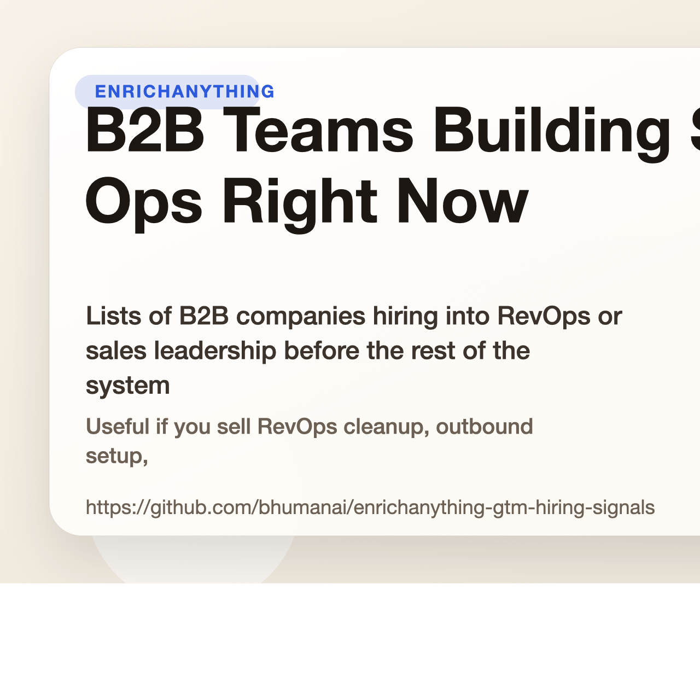

# B2B Teams Building Sales Ops Right Now

Lists of B2B companies hiring into RevOps or sales leadership before the rest of the system is fully built.

Useful if you sell RevOps cleanup, outbound setup, reporting rebuilds, or GTM recruiting into B2B teams.

## Start here

- Fastest first click: [B2B SaaS in Europe hiring RevOps while reporting still looks manual dataset](https://www.enrichanything.com/datasets/markets/b2b-saas-europe-hiring-revops-manual-reporting?utm_source=github&utm_medium=public_repo&utm_campaign=enrichanything-gtm-hiring-signals&utm_content=market-b2b-saas-europe-hiring-revops-manual-reporting-dataset) (live)
- Stable link: [B2B SaaS in Europe hiring RevOps while reporting still looks manual snapshot](https://www.enrichanything.com/snapshots/markets/b2b-saas-europe-hiring-revops-manual-reporting/2026-03-25-a1b79b6994?utm_source=github&utm_medium=public_repo&utm_campaign=enrichanything-gtm-hiring-signals&utm_content=market-b2b-saas-europe-hiring-revops-manual-reporting-snapshot)
- Matching note: [European B2B SaaS teams still hire around spreadsheet-heavy reporting before the RevOps system is clean dataset](https://www.enrichanything.com/datasets/reports/europe-revops-manual-reporting-gap?utm_source=github&utm_medium=public_repo&utm_campaign=enrichanything-gtm-hiring-signals&utm_content=report-europe-revops-manual-reporting-gap-dataset)
- Cleaner web version: [https://bhumanai.github.io/enrichanything-gtm-hiring-signals/](https://bhumanai.github.io/enrichanything-gtm-hiring-signals/)
- Full product: [EnrichAnything](https://www.enrichanything.com/?utm_source=github&utm_medium=public_repo&utm_campaign=enrichanything-gtm-hiring-signals&utm_content=repo-home)

- Source product: https://www.enrichanything.com
- GitHub repo: https://github.com/bhumanai/enrichanything-gtm-hiring-signals
- Dataset hub: https://www.enrichanything.com/datasets/
- Public API docs: https://www.enrichanything.com/api/
- OpenAPI spec: https://www.enrichanything.com/openapi.json
- Last refresh: April 6, 2026
- Refresh command: `npm run refresh`

## Developer links

- Dataset hub: [EnrichAnything datasets](https://www.enrichanything.com/datasets/)
- Public API docs: [EnrichAnything API](https://www.enrichanything.com/api/)
- Node SDK repo: [enrichanything-public-api-node](https://github.com/bhumanai/enrichanything-public-api-node)
- Python SDK repo: [enrichanything-public-api-python](https://github.com/bhumanai/enrichanything-public-api-python)

## Use this repo if...

- RevOps consultants: Lead with reporting cleanup. The wedge is that the company is already hiring around data and process friction instead of fixing the system cleanly. Start with [B2B SaaS in Europe hiring RevOps while reporting still looks manual](https://www.enrichanything.com/datasets/markets/b2b-saas-europe-hiring-revops-manual-reporting?utm_source=github&utm_medium=public_repo&utm_campaign=enrichanything-gtm-hiring-signals&utm_content=market-b2b-saas-europe-hiring-revops-manual-reporting-dataset) (live).
- Outbound agencies: Use this when a company clearly wants pipeline but still looks early on sequencing, routing, and sales plumbing. Start with [Recently funded startups in Europe hiring GTM leaders without mature sales infrastructure](https://www.enrichanything.com/datasets/markets/recently-funded-europe-startups-hiring-gtm-leaders?utm_source=github&utm_medium=public_repo&utm_campaign=enrichanything-gtm-hiring-signals&utm_content=market-recently-funded-europe-startups-hiring-gtm-leaders-dataset) (live).
- GTM recruiters: The list helps you spot teams building go-to-market muscle quickly, even before the rest of the revenue stack catches up. Start with [Recently funded startups in Europe hiring GTM leaders without mature sales infrastructure](https://www.enrichanything.com/datasets/markets/recently-funded-europe-startups-hiring-gtm-leaders?utm_source=github&utm_medium=public_repo&utm_campaign=enrichanything-gtm-hiring-signals&utm_content=market-recently-funded-europe-startups-hiring-gtm-leaders-dataset) (live).

## Lists you can use now

| List | Status | Rows | Dataset | Live list |
| --- | --- | ---: | --- | --- |
| [B2B SaaS in Europe hiring RevOps while reporting still looks manual](markets/b2b-saas-europe-hiring-revops-manual-reporting/README.md) | live | 20 | [Dataset](https://www.enrichanything.com/datasets/markets/b2b-saas-europe-hiring-revops-manual-reporting?utm_source=github&utm_medium=public_repo&utm_campaign=enrichanything-gtm-hiring-signals&utm_content=market-b2b-saas-europe-hiring-revops-manual-reporting-dataset) | [Live list](https://www.enrichanything.com/markets/b2b-saas-europe-hiring-revops-manual-reporting?utm_source=github&utm_medium=public_repo&utm_campaign=enrichanything-gtm-hiring-signals&utm_content=market-b2b-saas-europe-hiring-revops-manual-reporting) |
| [Recently funded startups in Europe hiring GTM leaders without mature sales infrastructure](markets/recently-funded-europe-startups-hiring-gtm-leaders/README.md) | live | 20 | [Dataset](https://www.enrichanything.com/datasets/markets/recently-funded-europe-startups-hiring-gtm-leaders?utm_source=github&utm_medium=public_repo&utm_campaign=enrichanything-gtm-hiring-signals&utm_content=market-recently-funded-europe-startups-hiring-gtm-leaders-dataset) | [Live list](https://www.enrichanything.com/markets/recently-funded-europe-startups-hiring-gtm-leaders?utm_source=github&utm_medium=public_repo&utm_campaign=enrichanything-gtm-hiring-signals&utm_content=market-recently-funded-europe-startups-hiring-gtm-leaders) |

## Notes that explain the market

| Note | Status | Rows | Dataset | Source note |
| --- | --- | ---: | --- | --- |
| [European B2B SaaS teams still hire around spreadsheet-heavy reporting before the RevOps system is clean](reports/europe-revops-manual-reporting-gap/README.md) | live | 20 | [Dataset](https://www.enrichanything.com/datasets/reports/europe-revops-manual-reporting-gap?utm_source=github&utm_medium=public_repo&utm_campaign=enrichanything-gtm-hiring-signals&utm_content=report-europe-revops-manual-reporting-gap-dataset) | [Source note](https://www.enrichanything.com/reports/europe-revops-manual-reporting-gap?utm_source=github&utm_medium=public_repo&utm_campaign=enrichanything-gtm-hiring-signals&utm_content=report-europe-revops-manual-reporting-gap) |
| [Recently funded startups in Europe often hire GTM leaders before the sales system is fully built](reports/europe-funded-gtm-hiring-gap/README.md) | live | 20 | [Dataset](https://www.enrichanything.com/datasets/reports/europe-funded-gtm-hiring-gap?utm_source=github&utm_medium=public_repo&utm_campaign=enrichanything-gtm-hiring-signals&utm_content=report-europe-funded-gtm-hiring-gap-dataset) | [Source note](https://www.enrichanything.com/reports/europe-funded-gtm-hiring-gap?utm_source=github&utm_medium=public_repo&utm_campaign=enrichanything-gtm-hiring-signals&utm_content=report-europe-funded-gtm-hiring-gap) |

## Still queued up

These list ideas exist already, but the public sample is not ready yet.

| List | Status |
| --- | --- |
| [Series A SaaS hiring SDRs but not using sequencing tools](markets/series-a-saas-hiring-sdr-no-sequencing/README.md) | template only |

## Notes still queued up

| Note | Status |
| --- | --- |
| [Series A SaaS teams still hire SDRs before they buy sequencing infrastructure](reports/series-a-sdr-tooling-gap/README.md) | template only |

## Need a custom cut?

Open [EnrichAnything](https://www.enrichanything.com/?utm_source=github&utm_medium=public_repo&utm_campaign=enrichanything-gtm-hiring-signals&utm_content=repo-home) if you want more columns, a fresh export, or the same pattern for a different niche.
